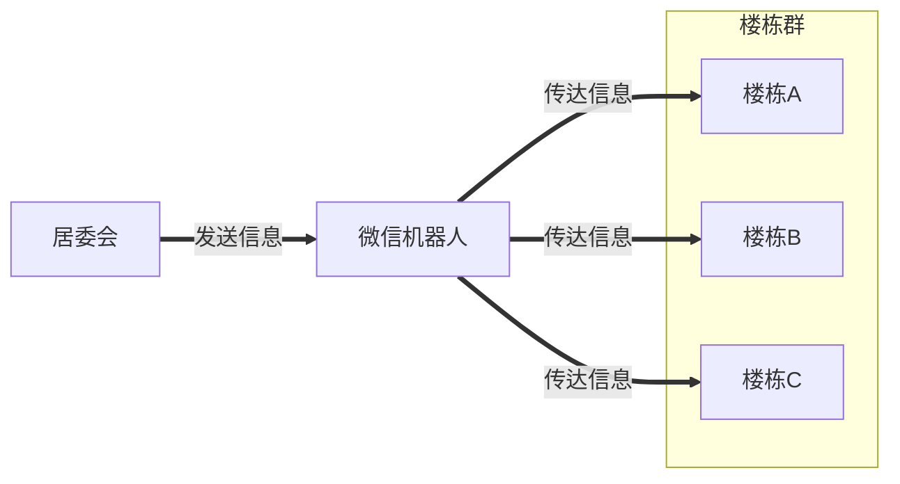
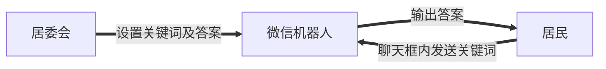
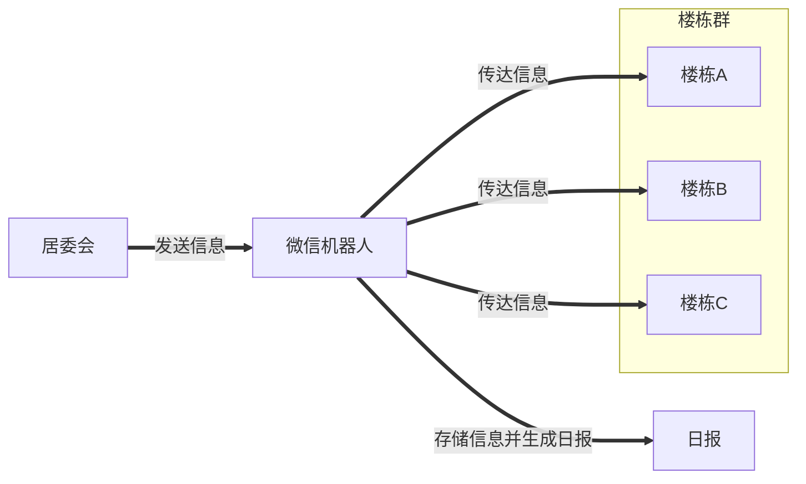
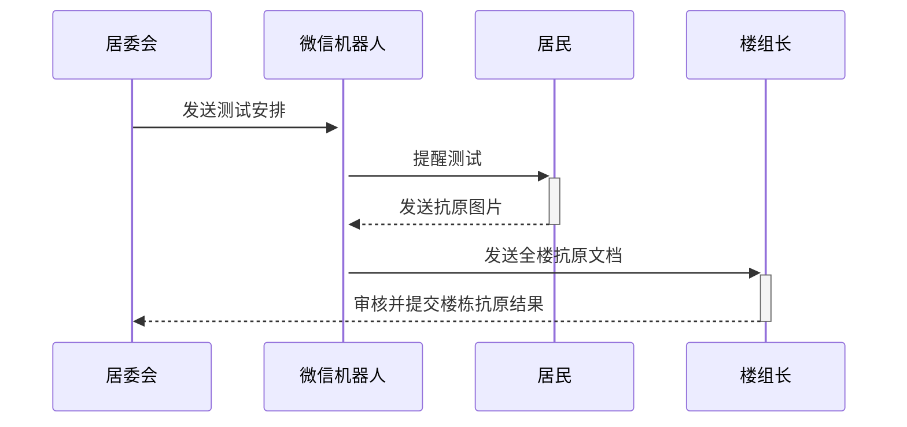
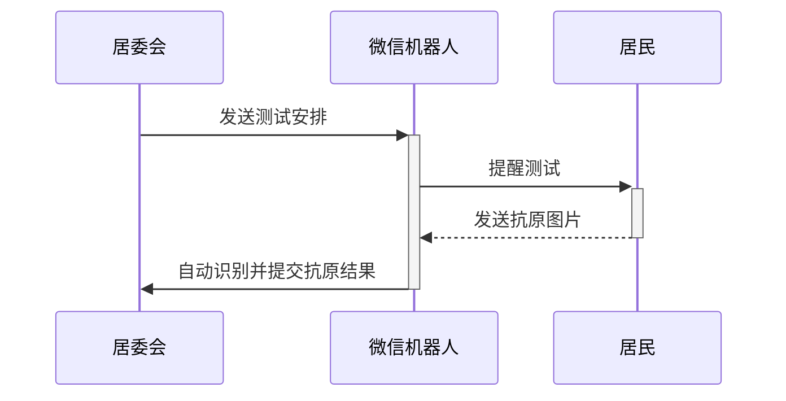

# AntigenWechatBot 

[Chinese Description](README.md) | [English Description](README.EN.md)

AntigenWechatBot is a wechat bot that aims enpowering the primary-level government workers. It is designed during the pandemic in Shanghai, and contains different functions that can automate basic jobs of the primary-level government workers, for example, antigen information collection, pandemic information delivery and group purchase announcement.

## Story

Currently in our neighbourhood, the number of primary-level government workers are limited, but too many neighbours to serve. Because of the lack of usage of information and computer technologies, their work are also unefficient. As a primary-level worker as example, during this pandemic, he should organize group purchase and ask for voluteers to help move the goods to every family in this community, deliver antigen testings and collect antigen testing results, organize nucleic acid test, send out information in every single wechat group for each building (due to the number limit of wechat group). Many of these things are repeated, wasting their time in those simple affairs, and doesn't have time to think about higher-level issues, and doesn't have enough backup for potential crisis. 

Computer and information technologies can help this a lot, as most of the things are repeatable, and already based on smart devices. With the help of wechat bot, Users have little learning cost and can solve the majority of the problems mentioned above.


## Demand

An automatic wechat bot that   

    1. Deliver pandemic news and group purchase notice                       
    
    2. Remind neighbours to do antigen testing and collect antigen results    
    
## About the Code

Please add 2 files into the main folder before using it: message_forworder.json and pre_words.json.

pre_wrods.json is a json file that contains some default message in case some situations are called. Here is an example:

```
{
    "no_support_type": "对不起，该功能暂不支持",
    "hello_qun": "大家好",
    "failed_add_qun": "加群失败",
    "welcome": "欢迎入群",
    "alias_reminder": "您还没改群名称哦",
    "no_qun": "您还没有可发送的群", 
    "no_change": "只有群主可以更改群聊名称哦", 
    "introduce": "您好呀，从今天起我就是您的社区管理AI小助理啦",
    "not_user":"不是用户不能拉群，提醒他联系管理员"
}
```

message_forworder.json contains some Juweihui's information. Here is the template

```
{
    "JuWeihui1 居委会管理员1": [
        "List Of JuWeiHui1's Group",
        "居委会管理员1管理的群聊"
    ],
    "JuWeihui2 居委会管理员2": [
        "List Of JuWeiHui2's Group",
        "居委会管理员2管理的群聊"
    ],
    "JuWeihui3 居委会管理员3": [
        "List Of JuWeiHui3's Group",
        "居委会管理员3管理的群聊"
    ]
}
```

## Plan for Deliver news

### Phase 1

An wechat bot that can deliver news to all the related inhabitants, where the worker send a information to the bot in a private chat, and the bot will deliver this message to all the wechat groups for each building. Information includes nucleic acid test arrangement, volunteer recruitment and group purchase notice. Daily pandemic newsletter should also be included.




### Phase1.5

Integrated ASR function.
This is mainly for special users, such as elderly users, who can generally only send voice (still in Shanghainese)

### Phase 2

Add very simple question-answer bot. In this phase, we do not want NLP technology include, but set some special keyword, like daily-report, so that the user can type the keyword in the chat box and the bot will automatically reply with the answer.



### Phase 2.1

Should be done in parallel as phase 2. Daily report auto-generate program.



### Phase 3.1

Add all group purchase information into the message-deliver bot.

### Phase 3.2

Question-answering bot uses NLP technology so that users do not need to remember the keywords and more questions can be answered. Involve answer database so that workers do not need to answer same questions from different sources multiple times.

## Plan for antigen

### Phase 1

Given a time period of antigen self-testing, the bot will send message to the chat to remind people to do the antigen testing. Every user can upload images, and the bot will collect the image and generate a file after every room has its own image. When someone doesn't finish the antigen, the bot will automatically remind the user to upload the testing result every several minutes. An administrator should be elected in each building that responsible for checking the file and report the result of the file to the primary-level government workers.



PS. Advantage is that the administrator will no longer need to check if everyone has uploaded the image or not, nor worrying about the unsorted room numbers. It will reduce the administrator's work from $O(N^2)$ to $O(N)$.

### Phase 2

Add Computer Vision technologies into the wechat bot that can automatically do the job of the building administrator. In this case, no worker is needed in this system and all the process can be done automatically.



## Something more to mention...

This automatic bot is not aimed to replace the warm connection between primary-level workers and inhabitants in the community. On the contrary, the bot is aimed to help reduce the waste of time on repeat affairs, so that primary-level workers can have more time to figure out the high-level demand of the inhabitants, and finally better serve the people. We would like to enhance the connection between primary-level government workers and the people, so that help Shanghai to have joint effort to overcome the pandemic!

## Advisory Committee

[Huan](https://github.com/huan) [(李卓桓)](http://linkedin.com/in/zixia), Tencent TVP of Chatbot.

[](https://stackoverflow.com/users/1123955/huan)