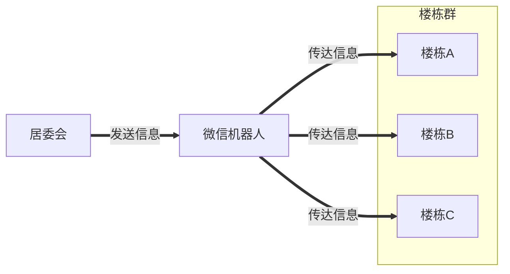
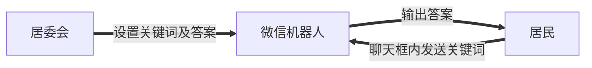
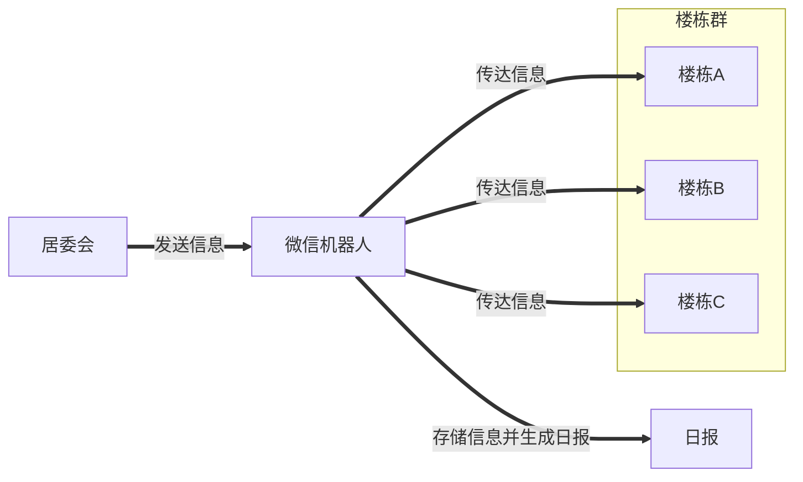
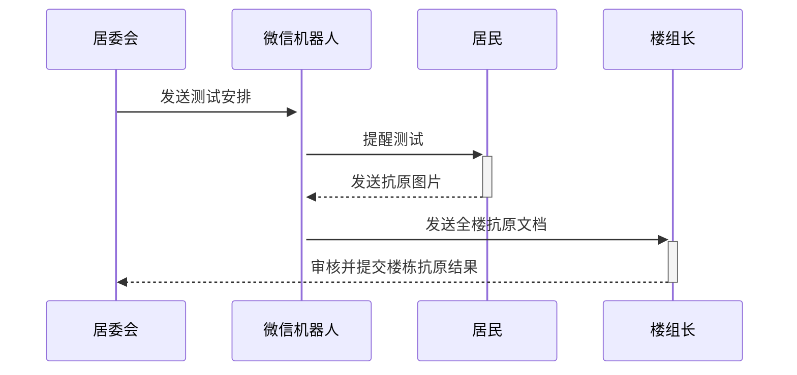
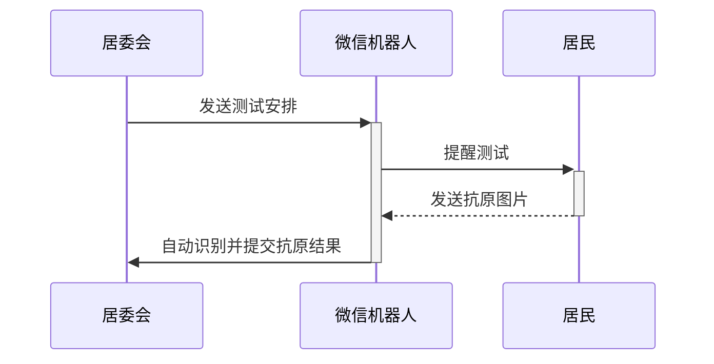

# AntigenWechatBot 

[中文说明](README.md) | [英文说明](README.EN.md)

AntigenWechatBot是一个用于为基层干部（居委会干部）赋能的微信机器人。我们在上海疫情期间开始开发这款软件。它包含但不限于以下功能：抗原数据采集，疫情信息分发和团购信息宣传。

## 背景

以我们小区为例，我们的基层工作者和居委会人员人数非常有限，但是却要服务大量的居民。与此同时，由于信息服务和计算机技术在基层工作中的缺失，相关工作人员的工作效率却又比较低下。以一个基层工作者的工作为例，他需要组织团购并组织志愿者分发团购货品，分发抗原并统计抗原结果，组织核酸检测，在每个楼栋群里分发小区信息（检测、团购、疫情状况），且因为微信群人数上限为500人，远小于一个小区的总人数，故他们有大量的群聊需要管理。这些繁杂而重复的事务浪费了他们大量的时间，让他们陷在琐碎中不能自拔，而没有时间思考更重要的事，也对未来可能出现的危机缺乏冗余。

幸运的是，信息技术可以帮助解决上述可重复的问题。居民们已有的生活习惯已经基于智能设备，只要使用微信机器人，用户可以在极低的学习成本下摆脱大量重复工作。

## 需求

自动化微信机器人的功能需求如下所示：

    1. 分发疫情信息以及团购信息  
    
    2. 提醒居民做抗原测试及采集抗原测试结果  
    

## 开发计划

### 第一阶段

第一阶段的微信机器人将用于发送信息给所有居民。居委会工作人员仅需要将需要转发的信息私聊发送给微信机器人，微信机器人会将信息分发给每一个楼栋群。分发的信息包括但不限于核酸采样通知，志愿者招募以及团购信息。疫情周报也需要被囊括其中。

增加ASR功能用于服务特殊用户，诸如老人或只能发送语音信息的人（上海话）

### 第二阶段

一个简单的问答机器人，用于帮人快速定位错过的信息。用户可以输入给定的关键词，如疫情日报，并得到相应的预存的回答。用户仅需在所有注册的楼栋群内发送关键词即可获得答案。此阶段不支持模糊查询。

应和第二阶段同时开发：日报自动生成器。采集居委会在第一阶段中就会发送的信息，自动生成日报。

### 第三阶段

团购信息整合入微信机器人。此处为工地，暂无满意的系统设计。

NLP技术支持的微信问答机器人，可以存储居委会对已有的问题的回答，分析问题的相似性并对相似的问题给出回到。此处为工地，暂无满意的系统设计。

## Antigen 机器人的开发计划
### 第一阶段

给定一段抗原测试时间，微信机器人会提醒人们去做抗原测试。每个用户可以自动提交图片，然后当所有人提交完毕后，机器人将整理好图片顺序并生成一份总结文档。若有人临期仍然没有完成，机器人将每隔一段时间进行提醒。每栋楼需选出一个代表检查文档中是否全阴，并将结果提交给居委会。

PS. 这个项目的优势在于楼组长将不必要看是否每个人都已经完成抗原检测，并且也不会受困于错序的居民上传顺序。楼组长的工作时间将从$O(N^2)$降至$O(N)$.
    
### 第二阶段

添加计算机视觉技术，可以自动检测抗原结果，从此整个抗原检测结果检测无需任何人工加入。

## 还有一些想说话的话

还有一些想说的话。这个bot的目的不是用冷冰冰的机器来取代基层工作者和人民之间的联系。与之相反，我们旨在将基层工作者从重复、繁杂、琐碎的工作中解放出来，让他们更有动力去深入了解人民的高层次需求，以建立更温暖更友善的联系，并更好的服务于人民，建立鱼水情。我相信，只有增强这种联系，我们上海才能共同努力，一起克服这如洪水猛兽般的疫情！

## 项目顾问

[Huan](https://github.com/huan) [(李卓桓)](http://linkedin.com/in/zixia), Tencent TVP of Chatbot.

